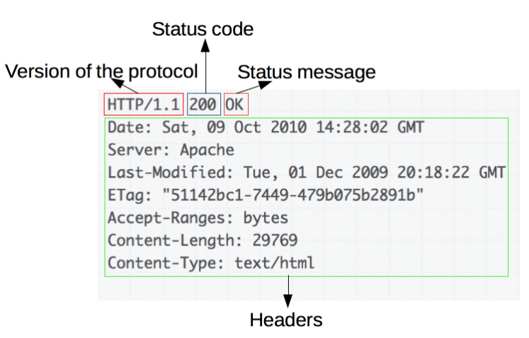

# 웹의 동작(HTTP 프로토콜 이해)

# 1. 인터넷(네트윅 통신)의 이해

- **인터넷**과 **웹(WWW, World Wide Web)** 은 다르다.

  - **웹**은 인터넷 기반의 대표 서비스 중 하나
  - 물리적인 하나의 컴퓨터는 포트(Port) 값으로 구분된 여러 개의 서버가 동작 (HTTP는 기본적으로 80번 포트를 사용한다.)

    

    인터넷 기반의 여러 서비스들이 있다.

  - **인터넷 (Internet)**
    - TCP/IP 기반의 네트워크가 전세계적으로 확대되어 하나로 연결된 네트워크들의 네트워크 (네트워크의 결합체)

# 2. HTTP(Hypertext Transfer Protocol)

- 팀 버너스리(Tim Berners-Lee)와 그가 속한 팀은 CERN(유럽 입자 물리학 연구소)에서 HTML뿐만 아니라 웹 브라우저 및 웹 브라우저 관련 기술과 HTTP를 발명
  - 문서화된 최초의 HTTP 버전은 **HTTP v0.9**(1991년) 이다.
- 서버와 클라이언트가 인터넷상에서 데이터를 주고받기 위한 프로토콜(Protocol)
  - 이미지, 동영상, 오디오, 텍스트 문서 등 어떤 종류의 데이터도 전송할 수 있도록 설계되어 있다.
- 현재 계속 발전하여 HTTP/2 까지 버전이 등장한 형태

## 2-1. HTTP의 작동방식

- HTTP는 서버/클라이언트 모델을 따른다
  - 클라이언트가 먼저 서버에게 요청을 보내면 서버는 클라이언트에게 응답을 보낸다.

### 장점

- 불특정 다수를 대상으로 하는 서비스에 적합하다
- 클라이언트와 서버가 계속 연결된 형태가 아니기 때문에 클라이언트와 서버 간의 최대 연결 수보다 훨씬 많은 요청과 응답을 처리할 수 있다.

### 단점

- HTTP는 **무상태 프로토콜(Stateless Protocol)**이라고도 부른다.
  - 클라이언트와 서버의 요청과 응답이 끝나게 되면 연결을 끊어버리기 때문에, 클라이언트의 이전 상황을 알 수가 없다.
    - 이러한 특징을 **무상태(Stateless)** 라고 말한다.
    - 이러한 특징 때문에 정보를 유지하기 위해서 Cookie와 같은 기술이 등장하게 됨

## 2-2. URL (Uniform Resource Locator)

- 인터넷 상의 자원의 위치
  - 특정 웹 서버의 특정 파일에 접근하기 위한 경로 혹은 주소
  - URL은 최대 3부분으로 나누어진다.
    - 접근 프로토콜(프로토콜의 종류) :// IP 주소 또는 도메인 이름(:포트 번호) / 문서의 경로 / 문서 이름
      (http://www.sunnyvale.co.kr/docs/index.html) - IP 주소 또는 도메인 이름으로 물리적인 서버를 찾는다 → 포트 번호로 해당 컴퓨터 안의 소프트웨어 서버를 찾는다.

## 2-3. Request (요청 데이터 포멧)

### HTTP Request Method

**첫 번째 줄(요청 헤더)**

- 요청 메소드 : GET, PUT, POST, PUSH, OPTIONS 등의 요청 방식이 온다.
  - 서버에게 요청의 종류를 알려주기 위해서 사용된다.
    - 각각의 메소드 이름은 다음과 같은 의미를 가진다.
    - GET : 정보를 요청하기 위해서 사용 (SELECT)
      - GET 방식은 요청할 때 가지고 가는 자원들을 URI에 붙이고 가므로 요청 바디가 없다.
    - POST : 정보를 밀어넣기 위해서 사용 (INSERT)
    - PUT : 정보를 업데이트하기 위해서 사용 (UPDATE)
    - DELETE : 정보를 삭제하기 위해서 사용 (DELETE)
    - HEAD : (HTTP)헤더 정보만 요청
      - 해당 자원이 존재하는지 혹은 서버에 문제가 없는지 확인하기 위해 사용
    - OPTIONS : 웹서버가 지원하는 메서드의 종류를 요청
    - TRACE : 클라이언트의 요청을 그대로 반환
      - echo 서비스로 서버 상태를 확인하기 위한 목적으로 주로 사용
- 요청 URI : 요청하는 자원의 위치를 명시한다.
- HTTP 프로토콜 버전 : 웹 브라우저가 사용하는 프로토콜 버전
- 최초의 웹 서버는 GET 방식만 지원하였다.

**두 번째 줄(요청 헤더)**

- 각각의 줄의 헤더 값과 헤더 명이 콜론( **:** )으로 구분되어져 있음
  - 각 줄은 라인피드(Line Feed, LF)와, 캐리지 리턴(Carriage return, CR)으로 구분된다.
  - 라인 피드와 캐리지 리턴
    - 라인 피드 : 커서를 한 칸 아래로 이동(새로운 행 추가)
    - 캐리지 리턴 : 커서를 맨 왼쪽으로 이동(시작 위치로 복귀)

**요청 바디**

- 빈 줄 부분 이후에 요청 바디 등장
- 요청 메서드가 POST 나 PUT 을 사용하게 됐을 때 들어오게 된다.

## 2-4. Response (응답)

**첫 번째 줄(응답 헤더)**

- 응답 HTTP 프로토콜의 버전
- 응답 코드
- 응답 메시지

**나머지 헤더 부분**

- 날짜, 웹 서버 이름과 버전, 콘텐츠 타입
- 캐시 제어 방식, 콘텐츠 길이 등의 값이 들어온다.

**응답 바디**

- 실제 응답 리소스 데이터가 나오는 부분

## 응답 코드

### **100(정보) - 요청을 받았으며 프로세스를 계속한다.**

### 200(성공) - 요청을 성공적으로 받았으며 인식해서 처리했다.

### 300 (리다이렉션) - 요청 완료를 위해 추가 작업 조치가 필요하다.

### 400(클라이언트 에러) - 요청의 문법이 잘못되었거나 요청을 처리할 수 없다.

### 500(서버 에러) - 서버가 명백히 유효한 요청에 대해 충족을 실패했다.

# 3. HTTPS (HyperText Transfer Protocol Secure)

- HTTP애 데이터 암호화가 추가된 프로토콜
- HTTPS 는 HTTP와 다르게 433번 포트를 사용한다.
- 네트워크 상에서 중간에 제3자가 정보를 볼 수 없도록 공개키 암호화를 지원한다.
  - HTTPS 는 공개키/개인키 암호화 방식을 이용해 데이터를 암호화한다.
  - 공개키와 개인키는 서로를 위한 1쌍의 키이다.
    - 공개키 : 모두에게 공개 가능한 키
      - 공개키로 암호화를 하면 개인키로만 복호화 할 수 있다.
      - 개인키는 나만 가지고 있으므로 나만 볼 수 있음
    - 개인키 : 나만 가지고 알고 있어야 하는 키
      - 개인키로 암호화하면 공개키로 복호화 할 수 있다.
      - 공개키는 모두에게 공개되어 있으므로, 내가 인증한 정보임을 알려 신뢰성 보장

- HTTP → 보안 취약, HTTPS 보다 상대적으로 속도 빠름
- HTTPS → 보안 안전, HTTP 보다 상대적으로 속도 느림, HTTPS 인증서 발급 및 유지를 위한 추가 비용 발생
- 오늘날에는 속도 차이는 거의 없으므로 다루는 데이터가 민감한 정보인지 단순한 정보 조회 등을 처리하는지를 잘 구분해서 사용하면 된다.

---

10분 테코톡 - 웹 요청 & 응답과정 ([https://youtu.be/0jV7xOUcKog](https://youtu.be/0jV7xOUcKog))

위키백과 - HTTP ([https://ko.wikipedia.org/wiki/HTTP](https://ko.wikipedia.org/wiki/HTTP))

MDN -HTTP 개요 ([https://developer.mozilla.org/ko/docs/Web/HTTP/Overview](https://developer.mozilla.org/ko/docs/Web/HTTP/Overview))

MDN - HTTP의 진화 ([https://developer.mozilla.org/ko/docs/Web/HTTP/Basics_of_HTTP/Evolution_of_HTTP](https://developer.mozilla.org/ko/docs/Web/HTTP/Basics_of_HTTP/Evolution_of_HTTP))

10분 테코톡 - HTTP/1.1, HTTP/2 그리고 QUIC ([https://youtu.be/xcrjamphIp4](https://youtu.be/xcrjamphIp4))

망나니개발자 블로그 - HTTP와 HTTPS 및 차이점 ([https://mangkyu.tistory.com/98](https://mangkyu.tistory.com/98))
