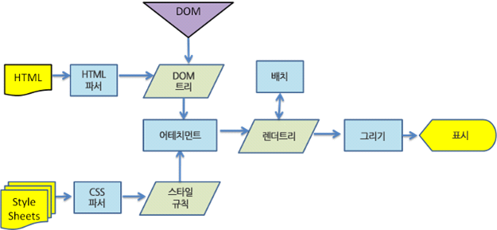
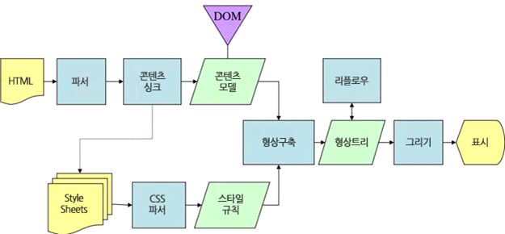
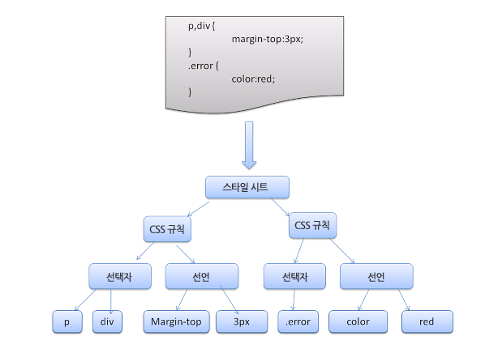
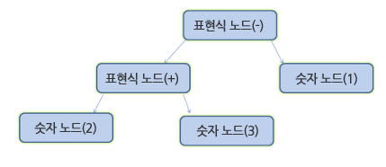
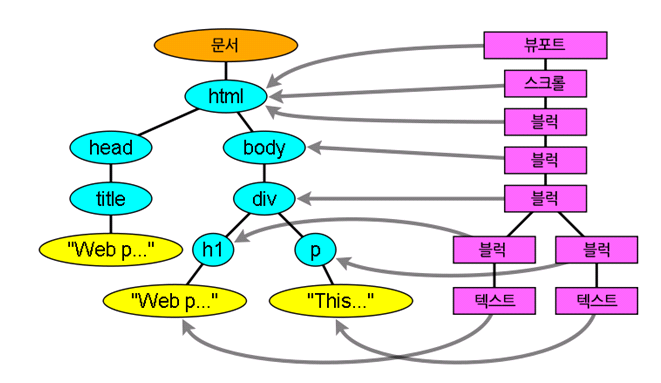

# 브라우저의 동작

# Browser

- 브라우저의 동작은 대개 숨겨져 있기 때문에 우리가 작성한 소스코드가 브라우저에서 빨리 실행되도록 하기 위해선 브라우저가 어떻게 동작하는지 이해해야 한다.

- 브라우저는 월드 와이드 웹(WWW)에서 정보를 검색, 표현하고 탐색하기 위한 소프트웨어이다.
  - 브라우저는 인터넷에서 특정 정보로 이동할 수 있는 주소 입력창이 있고 서버와 HTTP로 정보를 주고 받을 수 있는 네트워크 모듈을 포함하고 있다.
  - 서버에서 받은 문서(HTML, CSS, JS)를 해석하고 실행하여 화면에 표시하기 위한 해석기(Parser)들을 가지고 있다.

## Browser Component

- **사용자 인터페이스**

  - 사용자가 조작하는 부분

- **브라우저 엔진**
  - 브라우저 소프트웨어를 동작 시켜주는 핵심 엔진 (브라우저마다 서로 다른 엔진들을 포함하고 있다.)
  - **브라우저 엔진의 메인 플로우**
    - 사파리 브라우저에서 처리되는 웹킷 렌더링 엔진의 동작 과정
      
    - 모질라의 게코 렌더링 엔진의 동작과정
      
    1. 세부적인 것은 조금 다를 수 있지만, HTML을 해석해서 DOM 트리를 만들고, CSS를 해석해서 CSS 트리(CSS Object Model)을 만든다.
       - CSS 트리
         
    2. 이 과정에서 Parsing 과정이 필요하며, 토큰 단위로 해석을 하게 된다.
       - 문자 단위로 하나하나 해석을 해서 어떤 데이터 객체로 구조화 시킨다.
         - 2 + 3 = 1 이라는 내용이 있다면 2, +, 3, =, 1 을 모두 분리(이것을 토큰이라고 한다)한다.
         - 이것을 기준으로 어떤 Parse 트리(혹은 Syntax 트리)를 만들고, 그 트리에 따라서 어떤 값이 처리가 일어나게 된다.
           
           - 수학 표현식을 Parsing한 트리 노드
       - 주의할점은 컴파일은 CPU가 알아들을 수 있는 기계어 또는 VM이 알아들을 수 있는 바이트 코드로 변환하는 단계를 의미하므로 Parsing 작업이 컴파일 작업이라고 하는 것은 잘못된 표현이다.
    3. DOM 트리와 CSS 트리는 서로 연관되어 있으므로 Render 트리로 다시 조합되며, Render 트리에서 조합된 결과는 요소를 화면에 어떻게 배치할지에 대한 크기와 위치 정보를 담고 있다.
       - Key: Value 로 된 구조로 객체화 된다.
       - DOM 트리와 Render 트리의 대응
         - 뷰포트는 최초의 블록이다. 웹킷에서는 RenderView 객체가 이 역할을 한다.
           
    4. 이후에 이렇게 구성된 Render 트리 정보를 통해서 화면 어떤 부분에 어떻게 색칠을 할지 Painting 과정을 거치게 된다.
- **자료 저장소**
  - 데이터를 관리하는 영역
    - 브라우저도 일부의 데이터를 Cache를 하고 저장을 한다.
- **통신**
  - 네트워크 모듈
    - HTTP를 통해서 웹서버, 특정 인터넷 주소를 해석을 한 다음에 그 주소로 통신을 한다.
- **자바스크립트 해석기**
  - 자바스크립트 인터프리터
    - 자바스크립트 코드를 해석 할 수 있는 것
- **UI 백엔드**
  - UI영역을 처리할 수 있는 백엔드 영역

---

**참고자료**

- https://d2.naver.com/helloworld/59361
